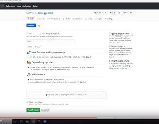

# Contributing to the Jenkins Docker JNLP Agent

## Getting started

1. Fork the repository on GitHub
2. Clone the forked repository to your machine
3. Install Docker
4. Build the images with `make` (Linux utility or Windows Powershell `make.ps1`)

## Testing changes

Follow the instructions in the [README](README.md#running) to run your image.

## Proposing Changes

The Jenkins project source code repositories are hosted at GitHub.
All proposed changes are submitted and code reviewed using the _GitHub Pull Request_ process.

To submit a pull request:

1. Commit changes and push them to your fork on GitHub.
It is a good practice is to create branches instead of pushing to master.
2. In GitHub Web UI click the _New Pull Request_ button
3. Select `jenkinsci` as _base fork_ and `master` as `base`, then click _Create Pull Request_
    * We integrate all changes into the master branch towards continuous delivery releases
4. Fill in the Pull Request description
5. Click _Create Pull Request_
6. Wait for CI results/reviews, process the feedback.
    * If you do not get feedback after 3 days, feel free to ping `@jenkinsci/code-reviewers` to CC.

Once a Pull Request is merged, the continuous delivery process will update the `latest` images
on [Dockerhub](https://hub.docker.com/r/jenkins/inbound-agent/tags?page=1&name=latest).

## Releasing the Docker Images

Oleg Nenashev provided a tutorial of the docker image release process in
[this video](https://youtu.be/rfUd-ymrXpo)

