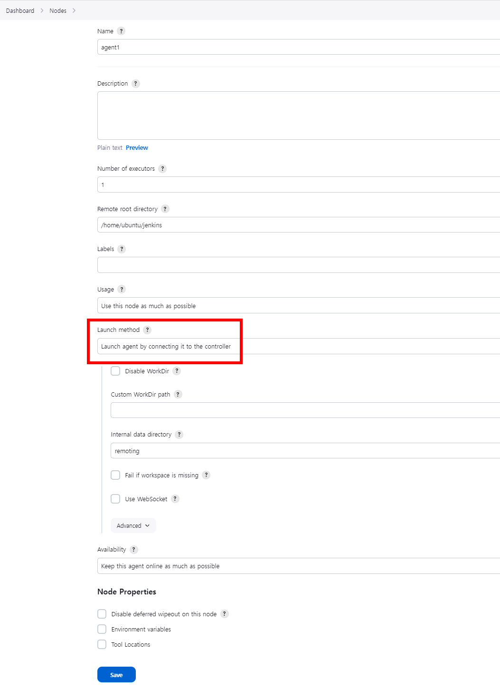
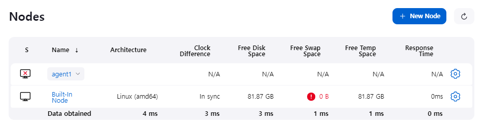
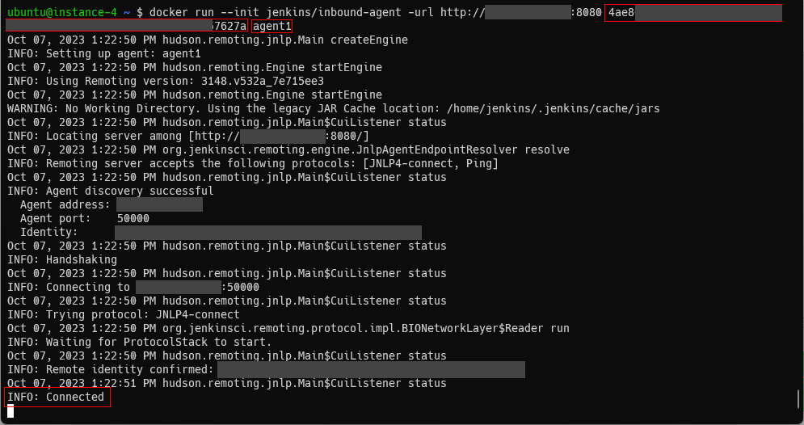
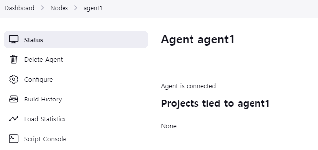

# Docker image for inbound Jenkins agents

:exclamation: **Warning!** This image used to be published as [jenkinsci/jnlp-slave](https://hub.docker.com/r/jenkinsci/jnlp-slave/) and [jenkins/jnlp-slave](https://hub.docker.com/r/jenkins/jnlp-slave/).
These images are deprecated, use [jenkins/inbound-agent](https://hub.docker.com/r/jenkins/inbound-agent/).

This is an image for [Jenkins](https://jenkins.io) agents using TCP or WebSockets to establish inbound connection to the Jenkins master.
This agent is powered by the [Jenkins Remoting library](https://github.com/jenkinsci/remoting), which version is being taken from the base [Docker Agent](https://github.com/jenkinsci/docker-agent/) image.

See [Using Agents](https://www.jenkins.io/doc/book/using/using-agents/) for more info.

## Configuring agents with this container image

### Setup the agent on Jenkins

1. Go to your Jenkins dashboard
2. Go to `Manage Jenkins` option in main menu
3. Go to `Nodes` item in `System Configuration`
  
4. Go to `New Node` option in side menu
5. Fill the Node(agent) name and select the type; (e.g. Name: agent1, Type: Permanent Agent)
6. Now fill the fields like remote root directory, labels, # of executors, etc.
  * **`Launch method` is `Launch agent by connecting it to the controller`**
    
7. Press the `Save` button and the agent1 will be registered, but offline for the time being. Click on it.
  
8. You should now see the secret. Use the secret value to pass it to the argument of container, or set to `JENKINS_SECRET` as environment variable.
  

### Running this container

To run a Docker container
  > **Note**  
  > Remember to replace the `<secret>` and `<agent name>` for secret and agent name, which can be you can get(and set) from [above section](#Setup-the-agent-on-Jenkins).  
  > Your agent node should be possible to connect to Jenkins controller with agent port (not Jenkins server's port like 80, 443, 8080), which can be set in `Manage Jenkins` > `Security` > `Agent`. Default port is 50000.  

  Linux agent:

    docker run --init jenkins/inbound-agent -url http://jenkins-server:port <secret> <agent name>
  Note: `--init` is necessary for correct subprocesses handling (zombie reaping)

  Windows agent:

    docker run jenkins/inbound-agent:windowsservercore-ltsc2019 -Url http://jenkins-server:port -Secret <secret> -Name <agent name>

To run a Docker container with [Work Directory](https://github.com/jenkinsci/remoting/blob/master/docs/workDir.md)

  Linux agent:

    docker run --init jenkins/inbound-agent -url http://jenkins-server:port -workDir=/home/jenkins/agent <secret> <agent name>

  Windows agent:

    docker run jenkins/inbound-agent:windowsservercore-ltsc2019 -Url http://jenkins-server:port -WorkDir=C:/Jenkins/agent -Secret <secret> -Name <agent name>

Optional environment variables:

* `JENKINS_JAVA_BIN`: Path to Java executable to use instead of the default in PATH or obtained from JAVA_HOME
* `JENKINS_JAVA_OPTS` : Java Options to use for the remoting process, otherwise obtained from JAVA_OPTS, **Warning** :exclamation: For more information on Windows usage, please see the **Windows Jenkins Java Opts** [section below](#windows-jenkins-java-opts).
* `JENKINS_URL`: url for the Jenkins server, can be used as a replacement to `-url` option, or to set alternate jenkins URL
* `JENKINS_TUNNEL`: (`HOST:PORT`) connect to this agent host and port instead of Jenkins server, assuming this one do route TCP traffic to Jenkins master. Useful when when Jenkins runs behind a load balancer, reverse proxy, etc.
* `JENKINS_SECRET`: (use only if not set as an argument) the secret as shown on the master after creating the agent
* `JENKINS_AGENT_NAME`: (use only if not set as an argument) the name of the agent, it should match the name you specified when creating the agent on the master
* `JENKINS_AGENT_WORKDIR`: agent work directory, if not set by optional parameter `-workDir`
* `JENKINS_WEB_SOCKET`: `true` if the connection should be made via WebSocket rather than TCP
* `JENKINS_DIRECT_CONNECTION`: (`HOST:PORT`) Connect directly to this TCP agent port, skipping the HTTP(S) connection parameter download.
* `JENKINS_INSTANCE_IDENTITY`: The base64 encoded InstanceIdentity byte array of the Jenkins master. When this is set, the agent skips connecting to an HTTP(S) port for connection info.
* `JENKINS_PROTOCOLS`: Specify the remoting protocols to attempt when `JENKINS_INSTANCE_IDENTITY` is provided.

#### Example

1. Enter the command above.
  
2. Check the Jenkins dashboard if the agent is connected well.
  

## Windows Jenkins Java Opts

The processing of the JENKINS_JAVA_OPTS environment variable or -JenkinsJavaOpts command line parameter follow the [command parsing semantics of Powershell](https://learn.microsoft.com/en-us/powershell/module/microsoft.powershell.core/about/about_parsing?view=powershell-7.3). This means that if a parameter contains any characters that are part of an expression in Powershell, it will need to be surrounded by quotes. 
For example:

-XX:+PrintCommandLineFlags --show-version

This would need to be escaped with quotes like this:

"-XX:+PrintCommandLineFlags" --show-version

Or another example:
-Dsome.property=some value --show-version

This would need to be escaped like this:

"-Dsome.property='some value'" --show-version

## Configuration specifics

### Enabled JNLP protocols

As of version 3.40-1 this image only supports the [JNLP4-connect](https://github.com/jenkinsci/remoting/blob/master/docs/protocols.md#jnlp4-connect) protocol.
Earlier, long-unsupported protocols have been removed.
As a result, Jenkins versions prior to 2.32 are no longer supported.

### Amazon ECS

Make sure your ECS container agent is [updated](http://docs.aws.amazon.com/AmazonECS/latest/developerguide/ecs-agent-update.html) before running. Older versions do not properly handle the entryPoint parameter. See the [entryPoint](http://docs.aws.amazon.com/AmazonECS/latest/developerguide/task_definition_parameters.html#container_definitions) definition for more information.
